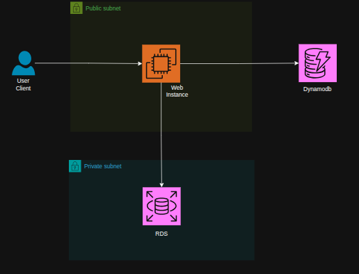

# Cloud Store - E-Commerce Web Application

## Project Overview

Cloud Store is a full-stack e-commerce web application built with Flask, AWS RDS PostgreSQL, and AWS DynamoDB. The application allows users to browse products publicly, add items to cart without authentication, and complete purchases after logging in or registering. 

**Database Architecture:**
- **RDS PostgreSQL**: User accounts and authentication
- **DynamoDB**: Products catalog, orders, and shopping cart

## Architecture



### System Components

The application follows a three-tier architecture with hybrid database storage:

1. **Presentation Layer**: HTML/CSS/JavaScript frontend with responsive design
2. **Application Layer**: Python Flask REST API with JWT authentication
3. **Data Layer**: 
   - AWS RDS PostgreSQL for user management
   - AWS DynamoDB for e-commerce data (products, orders, cart)

### Database Distribution

#### RDS PostgreSQL (Relational Data)
Stores user accounts and authentication:
- **Users Table**: user_id, email, password_hash, name, timestamps
- Why RDS: Strong consistency for authentication, ACID compliance, complex queries

#### DynamoDB (E-Commerce Data)
Stores products and transactional data:
- **Products Table**: product_id (PK), category (SK), name, price, stock
- **Orders Table**: user_id (PK), order_id (SK), items, total, shipping
- **Cart Table**: user_id (PK), items, updated_at
- Why DynamoDB: High scalability, fast reads/writes, no GSI needed with sort keys

## Technology Stack

### Backend
- **Python 3.12+**: Primary programming language
- **Flask 3.0**: Web framework for RESTful API
- **boto3**: AWS SDK for DynamoDB integration
- **psycopg**: PostgreSQL adapter for RDS (v3)
- **PyJWT**: JSON Web Token implementation
- **bcrypt**: Password hashing and verification
- **Flask-CORS**: Cross-Origin Resource Sharing support

### Frontend
- **HTML5**: Semantic markup
- **CSS3**: Modern styling with glassmorphism effects
- **JavaScript ES6+**: Interactive functionality
- **Font Awesome**: Icon library
- **Google Fonts (Inter)**: Typography

### Cloud Services
- **AWS RDS PostgreSQL**: User management database
- **AWS DynamoDB**: Products, orders, and cart storage
- **AWS IAM**: Identity and access management

## Features

### Public Features (No Authentication Required)
- Browse complete product catalog
- View product details
- Search products by name or description
- Filter products by category
- Add products to shopping cart
- View and modify shopping cart

### Authenticated Features (Login Required)
- User registration and login
- Complete checkout process
- View order history
- Secure session management

### Administrative Features
- Create new products
- Update product information
- Delete products
- Manage inventory

## Database Schema

### RDS PostgreSQL Schema

#### Users Table

**Structure:**
- `user_id` (VARCHAR 50, Primary Key)
- `email` (VARCHAR 255, Unique, Indexed)
- `password_hash` (VARCHAR 255)
- `name` (VARCHAR 255)
- `created_at` (TIMESTAMP)
- `updated_at` (TIMESTAMP)

**Note:** Table is automatically created on first run by `aws_rds.py`

### DynamoDB Schema

#### Products Table
```
Partition Key: product_id (String)
Sort Key: category (String)

Attributes:
- product_id: Unique product identifier
- category: Product category (also sort key)
- name: Product name
- description: Product description
- price: Product price (Decimal)
- image_url: Product image URL
- stock: Available quantity
- created_at: Creation timestamp
```

#### Orders Table
```
Partition Key: user_id (String)
Sort Key: order_id (String)

Attributes:
- user_id: Reference to user (partition key)
- order_id: Unique order identifier (sort key)
- items: List of order items
- total_amount: Order total (Decimal)
- shipping_address: Delivery address (Map)
- status: Order status
- created_at: Order timestamp
```

#### Cart Table
```
Partition Key: user_id (String)

Attributes:
- user_id: Reference to user
- items: List of cart items
- updated_at: Last update timestamp
```

## API Endpoints

### Authentication Endpoints
```
POST /api/auth/register
- Register new user
- Request Body: {name, email, password}
- Response: {success, token, user}

POST /api/auth/login
- User login
- Request Body: {email, password}
- Response: {success, token, user}

GET /api/auth/verify
- Verify JWT token
- Headers: Authorization: Bearer {token}
- Response: {success, user}
```

### Product Endpoints (Public)
```
GET /api/products
- Get all products
- Query Parameters: category (optional)
- Response: {success, data, count}

GET /api/products/{product_id}
- Get single product
- Response: {success, data}
```

### Product Management (Admin, Authenticated)
```
POST /api/admin/products
- Create new product
- Headers: Authorization: Bearer {token}
- Request Body: {name, description, price, category, image_url, stock}
- Response: {success, data}

PUT /api/admin/products/{product_id}
- Update product
- Headers: Authorization: Bearer {token}
- Request Body: {fields to update}
- Response: {success, data}

DELETE /api/admin/products/{product_id}
- Delete product
- Headers: Authorization: Bearer {token}
- Response: {success, message}
```

### Cart Endpoints (Authenticated)
```
GET /api/cart
- Get user cart
- Headers: Authorization: Bearer {token}
- Response: {success, data}

POST /api/cart
- Save cart items
- Headers: Authorization: Bearer {token}
- Request Body: {items}
- Response: {success, data}

DELETE /api/cart
- Clear cart
- Headers: Authorization: Bearer {token}
- Response: {success, message}
```

### Order Endpoints (Authenticated)
```
POST /api/orders
- Create new order (checkout)
- Headers: Authorization: Bearer {token}
- Request Body: {items, total_amount, shipping_address}
- Response: {success, data}

GET /api/orders
- Get user order history
- Headers: Authorization: Bearer {token}
- Response: {success, data, count}
```

## Installation and Setup

### Prerequisites

- Python 3.12 or higher
- pip (Python package manager)
- AWS Account with RDS and DynamoDB access
- AWS IAM credentials with appropriate permissions

### Step 1: Clone and Setup Environment

```bash
cd /path/to/project
python3 -m venv venv
source venv/bin/activate  # On Windows: venv\Scripts\activate
pip install -r requirements.txt
```

### Step 2: Configure Environment Variables

Copy the example environment file:
```bash
cp .env.example .env
```

Edit `.env` and configure the following:

#### AWS Credentials
```
AWS_ACCESS_KEY_ID=your-access-key-id
AWS_SECRET_ACCESS_KEY=your-secret-access-key
AWS_SESSION_TOKEN=your-session-token  # Optional, for temporary credentials
AWS_REGION=ap-southeast-1
```

#### RDS Configuration
```
RDS_HOST=your-rds-endpoint.ap-southeast-1.rds.amazonaws.com
RDS_PORT=5432
RDS_DATABASE=ecommerce
RDS_USERNAME=postgres
RDS_PASSWORD=your-secure-password
```

#### JWT Secret Key
Generate a secure JWT secret key:
```bash
python3 -c "import secrets; print(secrets.token_hex(32))"
```

Copy the output and set it in `.env`:
```
JWT_SECRET_KEY=your-generated-secret-key-here
```

### Step 3: Initialize Database Tables

The application automatically creates tables on first run:
- **RDS**: Creates `users` table with index
- **DynamoDB**: Creates `Products`, `Orders`, and `Cart` tables

No manual table creation is required.

### Step 4: Seed Database with Products (Optional but Recommended)

Populate the database with 18 real AWS cloud computing products:

```bash
python seed_data.py
```

This will create:
- **4 Compute products**: EC2 instances, Lambda, Lightsail, CloudWatch
- **4 Storage products**: S3, EBS, Glacier, EFS, Backup
- **4 Database products**: RDS PostgreSQL, DynamoDB, ElastiCache, Aurora
- **4 Networking products**: VPC, CloudFront, Load Balancer, Route 53

All products include:
- Real product images from AWS
- Detailed descriptions in Indonesian
- Realistic pricing in IDR
- Stock availability

### Step 5: Run the Application

```bash
python app.py
```

The application will start on `http://localhost:5000`

Access the application in your web browser at the above URL.

## AWS Configuration

### RDS PostgreSQL Setup

1. Create RDS PostgreSQL instance (t3.micro or higher)
2. Configure security group to allow connections from EC2 (port 5432)
3. Create database named `ecommerce`
4. Note the endpoint URL, username, and password

### DynamoDB Setup

DynamoDB tables are created automatically with Pay-Per-Request billing mode. No manual configuration needed.

### AWS Session Token Support

For temporary credentials (AWS STS, EC2 instance roles, etc.), set the `AWS_SESSION_TOKEN` environment variable. The application automatically includes this token in AWS API requests.

## Application Workflow

### Customer Journey

1. **Browse Products**
   - User visits homepage
   - Views product grid with filters
   - Can search by keyword

2. **Add to Cart**
   - Click "Add to Cart" on products
   - Cart stored in browser localStorage
   - Cart count updated in navigation

3. **View Cart**
   - Navigate to cart page
   - Modify quantities or remove items
   - View order summary with tax

4. **Checkout**
   - Click "Proceed to Checkout"
   - Redirected to login if not authenticated
   - Fill shipping information
   - Place order

5. **Order Confirmation**
   - Order saved to DynamoDB
   - Cart cleared
   - Order appears in order history

## Security Features

### Password Security
- Passwords hashed using bcrypt with salt
- Passwords never stored in plain text
- Minimum 6-character requirement

### Authentication
- JWT tokens for session management
- 24-hour token expiry (configurable)
- Tokens stored in browser localStorage
- Protected routes require valid JWT

### AWS Security
- Credentials stored in environment variables
- Session token support for temporary credentials
- No hardcoded credentials in code

## EC2 Deployment Guide (Amazon Linux)

### Recommended Instance Type: t3.medium

**Specifications:**
- **vCPUs**: 2
- **Memory**: 4 GB
- **Network Performance**: Up to 5 Gbps
- **EBS-Optimized**: Yes

**Why t3.medium:**
- Sufficient memory for Flask application and database connections
- Burstable CPU credits for handling traffic spikes
- Cost-effective for small to medium e-commerce sites
- Good balance between performance and cost

### Deployment Steps

#### 1. Launch EC2 Instance

```
Instance Type : t3.medium
AMI           : Amazon Linux 2023 (al2023-ami)
Storage       : 20 GB GP3
Security Group: Allow ports 22 (SSH), 80 (HTTP), 443 (HTTPS), 5000 (Flask dev)
```

#### 2. Connect and Install Dependencies

```bash
ssh -i your-key.pem ec2-user@your-ec2-ip

# Update system
sudo dnf update -y

# Install Python 3.13, pip, git, and nginx
sudo dnf install python3.13 python3.13-pip git nginx -y
```

#### 3. Clone Repository and Install Python Packages

```bash
cd /home/ec2-user
git clone https://github.com/your-username/easy-ecommerce.git
cd easy-ecommerce

# Install dependencies (globally or use venv)
sudo pip3.13 install -r requirements.txt
```

#### 4. Configure Environment Variables

```bash
cp .env.example .env
nano .env
```

Set semua konfigurasi (AWS credentials, RDS, JWT secret, dll).

#### 5. Test Run (Manual)

```bash
python3.13 app.py
```

Pastikan app berjalan tanpa error, lalu `Ctrl+C` untuk stop.

---

### Setup Systemd Service

Dengan systemd, aplikasi akan **otomatis jalan saat boot** dan **auto-restart** kalau crash.

#### 1. Buat file service

```bash
sudo nano /etc/systemd/system/cloudstore.service
```

Isi dengan konfigurasi berikut:

```ini
[Unit]
Description=Cloud Store E-Commerce Application
After=network.target

[Service]
Type=simple
User=root
WorkingDirectory=/home/ec2-user/easy-ecommerce
ExecStart=/usr/bin/python3.13 app.py
Restart=always
RestartSec=5
Environment=PYTHONUNBUFFERED=1

[Install]
WantedBy=multi-user.target
```

> **Catatan:** Jika menggunakan virtual environment, ganti `ExecStart` menjadi:
> ```
> ExecStart=/home/ec2-user/easy-ecommerce/venv/bin/python app.py
> ```

#### 2. Aktifkan dan Jalankan Service

```bash
# Reload systemd agar mengenali service baru
sudo systemctl daemon-reload

# Aktifkan agar jalan otomatis saat boot
sudo systemctl enable cloudstore

# Jalankan service
sudo systemctl start cloudstore

# Cek status
sudo systemctl status cloudstore
```

#### 3. Perintah Management Service

```bash
# Lihat status service
sudo systemctl status cloudstore

# Stop service
sudo systemctl stop cloudstore

# Restart service (setelah update kode)
sudo systemctl restart cloudstore

# Lihat log secara realtime
sudo journalctl -u cloudstore -f

# Lihat 50 baris log terakhir
sudo journalctl -u cloudstore -n 50

# Disable auto-start saat boot
sudo systemctl disable cloudstore
```

#### 4. Workflow Update Kode

Setelah push perubahan dari lokal, jalankan di server:

```bash
cd /home/ec2-user/easy-ecommerce
git pull
sudo systemctl restart cloudstore

# Verifikasi berjalan normal
sudo systemctl status cloudstore
```

---

### Setup Nginx Reverse Proxy (Opsional)

Nginx berfungsi sebagai reverse proxy agar app bisa diakses via port 80 (HTTP).

#### 1. Konfigurasi Nginx

```bash
sudo nano /etc/nginx/conf.d/cloudstore.conf
```

Isi:

```nginx
server {
    listen 80;
    server_name your-domain.com;

    location / {
        proxy_pass http://127.0.0.1:5000;
        proxy_set_header Host $host;
        proxy_set_header X-Real-IP $remote_addr;
        proxy_set_header X-Forwarded-For $proxy_add_x_forwarded_for;
        proxy_set_header X-Forwarded-Proto $scheme;
    }

    location /static/ {
        alias /home/ec2-user/easy-ecommerce/static/;
        expires 7d;
        add_header Cache-Control "public, immutable";
    }
}
```

#### 2. Aktifkan Nginx

```bash
# Test konfigurasi
sudo nginx -t

# Start dan enable nginx
sudo systemctl start nginx
sudo systemctl enable nginx

# Reload setelah perubahan config
sudo systemctl reload nginx
```

## Development

### Adding Products

Products can be added via API endpoint or directly in DynamoDB console. Example product:

```json
{
  "product_id": "PROD-ABC123",
  "category": "compute",
  "name": "AWS EC2 Instance",
  "description": "Virtual server in the cloud",
  "price": 500000,
  "image_url": "https://example.com/ec2.png",
  "stock": 10
}
```

### Categories

Standard categories:
- compute
- storage
- database
- networking

## Troubleshooting

### RDS Connection Issues

**Problem**: Cannot connect to RDS
**Solution**: 
- Verify RDS security group allows connections from EC2
- Check RDS endpoint and credentials
- Ensure database exists
- Test connection: `psql -h RDS_HOST -U postgres -d ecommerce`

### DynamoDB Connection Issues

**Problem**: Cannot connect to DynamoDB
**Solution**: 
- Verify AWS credentials are correct
- Check IAM permissions
- Ensure correct AWS region is set

### Authentication Errors

**Problem**: Token expired or invalid
**Solution**:
- Clear browser localStorage
- Login again
- Check JWT_SECRET_KEY is consistent
- Verify token expiry settings


## License

This project is created for educational and portfolio purposes.

## Contact

For questions or support, please refer to project documentation or contact the development team.
